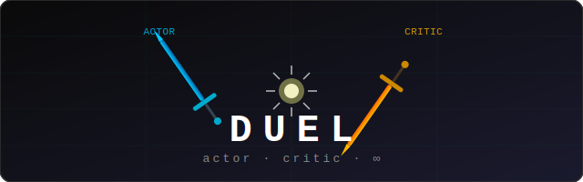
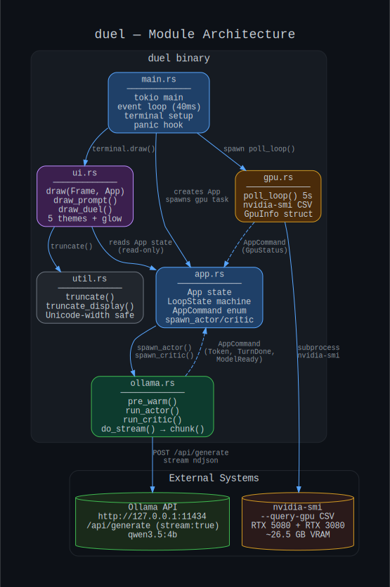
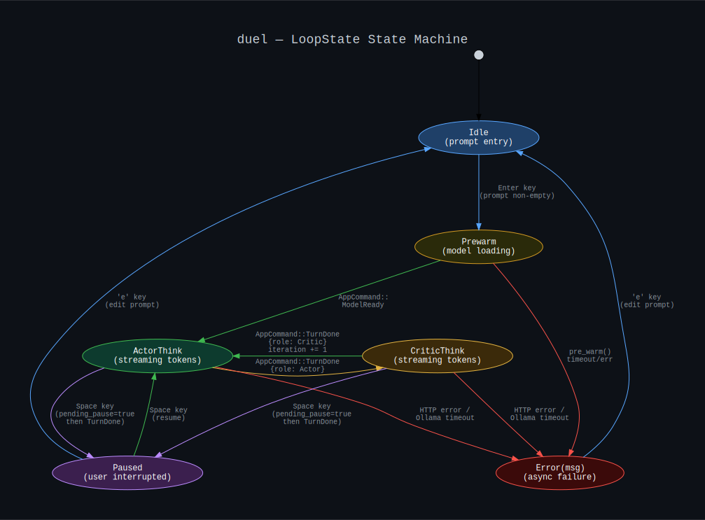
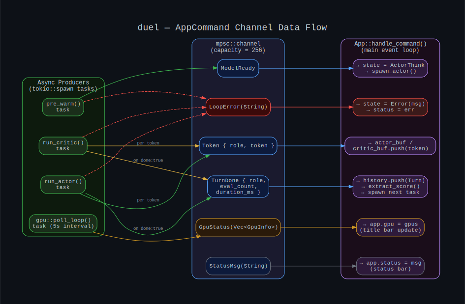
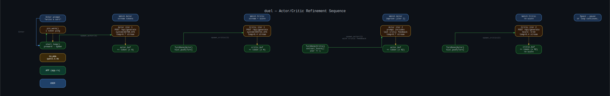
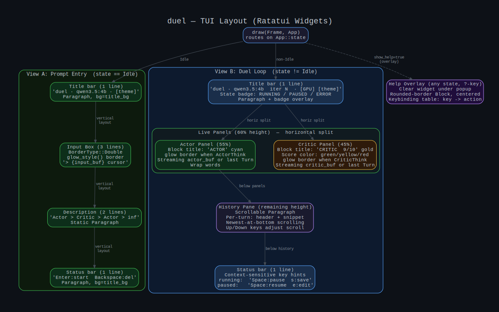

<div align="center">
  
</div>

<div align="center">


</div>

---

**duel** is a terminal UI that pits two AI agents against each other in an infinite self-improvement loop. The **Actor** generates a response to your prompt. The **Critic** tears it apart and scores it. The Actor incorporates that feedback and tries again. The loop runs until you pause it — or leave it running overnight.

Actor and Critic are Ollama models (default: `qwen3.5:4b` for both) differentiated by system prompts. You can run different models for each role, pick a Critic archetype, or supply fully custom system prompts. Tokens stream into each panel in real time. The Critic's score (`Score: X/10`) is parsed and colour-coded in the panel header. Every completed turn is saved in a scrollable history.

---

## How it works

<div align="center">
  
  <br/><em>Figure 1 — Module architecture and external dependencies</em>
</div>

The application is split into six Rust modules:

| Module | Responsibility |
|--------|---------------|
| `main.rs` | Tokio async runtime, terminal lifecycle, 40 ms event loop |
| `app.rs` | `App` state struct, `LoopState` machine, `AppCommand` enum, `handle_command()` |
| `ollama.rs` | HTTP streaming via `reqwest::chunk()` over ndjson, prompt construction |
| `ui.rs` | All Ratatui rendering — 5 themes, glow animations, live panels, history |
| `gpu.rs` | `nvidia-smi` poller every 5 s → GPU utilisation in the title bar |
| `util.rs` | Unicode-width-aware string truncation |

Background tasks (actor, critic, GPU poller) communicate with the main event loop exclusively through a `tokio::mpsc` channel of `AppCommand` variants — the UI never blocks on inference.

---

## State machine

<div align="center">
  
  <br/><em>Figure 2 — LoopState transitions</em>
</div>

The six states:

| State | Meaning |
|-------|---------|
| `Idle` | Prompt-entry screen — waiting for user input |
| `Prewarm` | Sending a 1-token ping to load `qwen3.5:4b` into VRAM |
| `ActorThink` | Actor task streaming tokens into `actor_buf` |
| `CriticThink` | Critic task streaming tokens into `critic_buf` |
| `Paused` | Loop suspended after the current turn completes |
| `Error(msg)` | Async failure — Ollama unreachable, timeout, etc. |

Pressing **Space** during `ActorThink` or `CriticThink` sets `pending_pause = true`; the pause takes effect after the current turn finishes so you never see a half-generated response.

---

## Data flow

<div align="center">
  
  <br/><em>Figure 3 — AppCommand message flow through the mpsc channel</em>
</div>

Every asynchronous event — a streamed token, a completed turn, a GPU reading, an error — arrives as an `AppCommand` variant. The main event loop drains the channel with `try_recv()` on each 40 ms tick, then dispatches to `App::handle_command()`:

```rust
pub enum AppCommand {
    Token       { role: Role, token: String },      // one streaming token
    TurnDone    { role: Role, eval_count: u32,
                  duration_ms: u64 },               // turn complete
    ModelReady,                                     // pre-warm succeeded
    LoopError(String),                              // any async failure
    GpuStatus(Vec<GpuInfo>),                        // nvidia-smi reading
    StatusMsg(String),                              // status bar message
}
```

---

## Actor/Critic loop sequence

<div align="center">
  
  <br/><em>Figure 4 — Full turn sequence across User, App, and Ollama swimlanes</em>
</div>

**Iteration 1 — Actor:**
```
POST /api/generate
  model:  qwen3.5:4b
  system: "You are the Actor. Generate the best possible response…"
  prompt: "{user prompt}"
  stream: true
  options: { temperature: 0.7 }
```

**Iteration 1 — Critic:**
```
POST /api/generate
  model:  qwen3.5:4b
  system: "You are the Critic. Evaluate… end with Score: X/10"
  prompt: "Actor's response (iteration 1):\n{actor_content}\n\nEvaluate it:"
  stream: true
  options: { temperature: 0.4 }
```

**Iteration 2+ — Actor (incorporates feedback):**
```
POST /api/generate
  system: <same Actor system prompt>
  prompt: "User task: {prompt}\n\nCritic feedback on your last response:\n{critic_content}\n\nGenerate your improved response now:"
```

The last 4 turns are kept in the prompt context (~2k tokens); this keeps the loop stable past 30+ iterations within qwen3.5:4b's 32 k context window.

---

## TUI layout

<div align="center">
  
  <br/><em>Figure 5 — Ratatui widget hierarchy for both views</em>
</div>

### Prompt-entry view

```
┌─────────────────────────────────────────────────────────────┐
│  duel  ·  qwen3.5:4b  ·  Classic                           │
├─────────────────────────────────────────────────────────────┤
│                                                             │
│  ╔═══════════════════════════════════════════════════════╗  │
│  ║  > Write a merge sort in Rust▌                        ║  │
│  ╚═══════════════════════════════════════════════════════╝  │
│                                                             │
│  Actor generates  →  Critic scores  →  Actor refines  →  ∞ │
│  The loop runs until you pause (Space) or quit (q).        │
├─────────────────────────────────────────────────────────────┤
│  Enter:start   Backspace:delete   Ctrl+T:theme   ?   q     │
└─────────────────────────────────────────────────────────────┘
```

### Duel-loop view

```
┌─────────────────────────────────────────────────────────────┐
│  duel  ·  qwen3.5:4b  iter 3  ·  [G0:85% 6048M]  [Classic] │  [● RUNNING]
├──────────────────────────────┬──────────────────────────────┤
│ ACTOR                        │ CRITIC              ▲ 9/10  │
│                              │                             │
│  Here is a merge sort using  │  Strengths: clear struct…  │
│  a recursive divide-and-     │  Weakness: no in-place     │
│  conquer approach…  ▌        │  variant shown. Suggest…   │
│                              │  Score: 9/10               │
├──────────────────── History (6 turns) ──────────────────────┤
│  [ACTOR]  iter 1 — 312tok  42t/s                           │
│    Here is a merge sort using a recursive divide…          │
│  [CRITIC] iter 1 — 198tok  38t/s  score:7/10              │
│    Strengths: correct output. Weakness: no error…          │
├─────────────────────────────────────────────────────────────┤
│  3/∞  Space:pause  s:save  ↑↓:history  Ctrl+T  ?  q       │
└─────────────────────────────────────────────────────────────┘
```

The active panel pulses with a sinusoidal RGB glow (1.4 s period). The Critic's score header is coloured green (≥ 8), yellow (5–7), or red (< 5).

---

## Quick start

### Prerequisites

- **Rust** 1.75+ — [rustup.rs](https://rustup.rs)
- **Ollama** running locally — [ollama.com](https://ollama.com)
- **qwen3.5:4b** model pulled:
  ```bash
  ollama pull qwen3.5:4b
  ```
- **nvidia-smi** — optional; GPU meters are hidden gracefully if absent

### Build & install

```bash
git clone https://github.com/danindiana/duel
cd duel
cargo build --release
sudo cp target/release/duel /usr/local/bin/duel
```

### Run

```bash
duel                                          # default settings
duel --actor devstral:24b --critic deepseek-r1:14b
duel --stop-at-score 9 --critic-mode adversarial
duel resume duel-session-2026-05-07T160030.json   # continue a saved session
```

Type your prompt and press **Enter** to start the loop. The model warms up on the first run (a few seconds), then the Actor/Critic cycle begins.

---

## Key bindings

| Key | State | Action |
|-----|-------|--------|
| `Enter` | Idle | Start the loop |
| `Backspace` | Idle | Delete last character |
| `Space` | Running | Pause after current turn |
| `Space` | Paused | Resume loop |
| `e` | Paused / Error | Return to prompt editor |
| `s` | Any (non-Idle) | Save session to JSON |
| `m` | Any (non-Idle) | Export session to Markdown |
| `h` | Any (non-Idle) | Export session to HTML |
| `↑` / `k` | Any | Scroll history up |
| `↓` / `j` | Any | Scroll history down |
| `Ctrl+T` | Any | Cycle theme (5 themes) |
| `?` | Any | Toggle help overlay |
| `q` / `Ctrl+C` | Any | Quit |

---

## Session save format

Press **`s`** at any time to save the full session to `duel-session-{timestamp}.json` in the current directory:

```json
{
  "prompt": "Write a merge sort in Rust",
  "actor_model": "qwen3.5:4b",
  "critic_model": "qwen3.5:4b",
  "saved_at": "2026-05-07T160030.123",
  "turns": [
    {
      "iteration": 1,
      "role": "actor",
      "content": "Here is a merge sort using a recursive divide-and-conquer approach…",
      "eval_count": 312,
      "duration_ms": 7400,
      "score": null
    },
    {
      "iteration": 1,
      "role": "critic",
      "content": "Strengths: correct output, clear structure…\nScore: 7/10",
      "eval_count": 198,
      "duration_ms": 5200,
      "score": 7
    }
  ]
}
```

---

## Configuration

### CLI flags

| Flag | Default | Notes |
|------|---------|-------|
| `--actor <model>` | `qwen3.5:4b` | Ollama model for the Actor role |
| `--critic <model>` | `qwen3.5:4b` | Ollama model for the Critic role |
| `--ollama-url <url>` | `http://127.0.0.1:11434` | Ollama API base URL |
| `--stop-at-score <n>` | off | Auto-pause when Critic scores ≥ n (1–10) |
| `--context-turns <n>` | `4` | Recent turns passed as context |
| `--max-history <n>` | unlimited | Cap history entries; oldest trimmed |
| `--critic-mode <mode>` | `default` | Critic archetype (see below) |
| `--actor-system <file>` | built-in | Load Actor system prompt from a text file |
| `--critic-system <file>` | built-in | Load Critic system prompt from a text file |
| `--actor-ollama-url <url>` | `--ollama-url` | Ollama URL for Actor (for per-GPU pinning) |
| `--critic-ollama-url <url>` | `--ollama-url` | Ollama URL for Critic (for per-GPU pinning) |

### Config file

Copy `example-config.toml` to `~/.config/duel/config.toml`. CLI flags override file values.

```toml
actor_model  = "devstral:24b"
critic_model = "deepseek-r1:14b"
stop_at_score = 9
critic_mode  = "peer"
```

### Critic archetypes (`--critic-mode`)

| Mode | Behaviour |
|------|-----------|
| `default` | Identifies weaknesses, gives 2-3 improvement suggestions, scores |
| `adversarial` | Challenges every assumption; relentlessly finds exploitable weak points |
| `socratic` | Asks 2-3 probing questions instead of giving direct feedback |
| `peer` | Collegial review — acknowledges strengths before suggesting improvements |
| `redteam` | Looks for security vulnerabilities, failure modes, and misuse vectors |

### System prompts

The built-in system prompts are defined in `src/config.rs` as string constants. Use `--actor-system <file>` or `--critic-system <file>` to supply a custom prompt at runtime, or set `actor_system` / `critic_system` inline in `~/.config/duel/config.toml`.

### Temperatures (hardcoded)

| Role | Temperature | Rationale |
|------|-------------|-----------|
| Actor | 0.7 | Higher creative variation across iterations |
| Critic | 0.4 | Consistent, precise evaluation |

### Recommended models

| Model | VRAM | Loop speed | Notes |
|-------|------|-----------|-------|
| `qwen3.5:4b` (default) | ~7 GB | Fast (~40 tok/s) | Good balance |
| `qwen3.5:9b` | ~9 GB | Medium | Higher quality critiques |
| `deepseek-r1:14b` | ~9 GB | Medium | Excellent reasoning chains |
| `devstral:24b` | ~14 GB | Slower | Best for code tasks |

---

## GPU requirements

`duel` itself requires no GPU — it is a thin HTTP client over Ollama. GPU acceleration comes from Ollama's inference backend:

- **NVIDIA CUDA (single GPU):** any model that fits in VRAM works out of the box
- **NVIDIA CUDA (dual GPU / tensor split):** set `CUDA_VISIBLE_DEVICES=0,1` in the Ollama systemd override; combined VRAM allows larger models
- **AMD ROCm:** build Ollama with ROCm support (`--build-arg=OLLAMA_SKIP_CUDA_GENERATE=1`); `duel` works without changes — the HTTP API is identical
- **CPU-only:** Ollama falls back to CPU automatically when no GPU is available; expect 5–20× slower generation but otherwise fully functional

The title bar shows live GPU utilisation and VRAM usage via `nvidia-smi`. On AMD or CPU-only machines the meter shows `[GPU:--]` and everything else continues normally.

### Dual-GPU model pinning

Run two Ollama instances, each bound to one GPU, then point each role at its own instance:

```bash
# In two separate terminals (or systemd instances):
CUDA_VISIBLE_DEVICES=0 OLLAMA_HOST=127.0.0.1:11434 ollama serve
CUDA_VISIBLE_DEVICES=1 OLLAMA_HOST=127.0.0.1:11435 ollama serve

duel --actor devstral:24b    --actor-ollama-url  http://127.0.0.1:11434 \
     --critic deepseek-r1:14b --critic-ollama-url http://127.0.0.1:11435
```

Both models are loaded with `keep_alive: -1` (indefinite VRAM residency) and warmed concurrently at startup, so every iteration runs from hot weights with no reload latency.

---

## Project structure

```
duel/
├── Cargo.toml
├── example-config.toml       # copy to ~/.config/duel/config.toml
├── CHANGELOG.md
├── CONTRIBUTING.md
├── src/
│   ├── main.rs          # entry point, event loop, key bindings
│   ├── app.rs           # state machine, AppCommand, exports, resume
│   ├── config.rs        # Config, CriticMode, CLI + TOML parsing
│   ├── ollama.rs        # streaming HTTP client
│   ├── ui.rs            # Ratatui rendering, themes
│   ├── gpu.rs           # nvidia-smi poller
│   └── util.rs          # string helpers
└── docs/
    ├── logo.svg
    ├── arch.svg              # Figure 1
    ├── state_machine.svg     # Figure 2
    ├── data_flow.svg         # Figure 3
    ├── actor_critic_loop.svg # Figure 4
    └── tui_layout.svg        # Figure 5
```

---

## License

MIT — see [LICENSE](LICENSE).

---

<div align="center">
  <sub>Built on <a href="https://ratatui.rs">ratatui.rs</a> · Powered by <a href="https://ollama.com">Ollama</a> · Runs on NVIDIA CUDA</sub>
</div>
